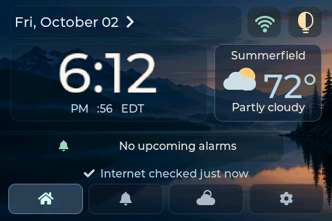
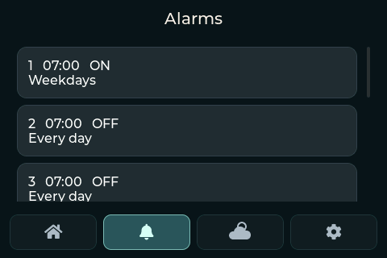

<div align="center">

# Smart Alarm Clock

### Your morning. Your music. Your wallpaper. Your hardware.

A touchscreen bedside clock built for the ESP32-C5.<br>
**The alarm stays local—even when the internet has other plans.**

[](LICENSE)


[](https://github.com/Wolfeitz/smart-alarm-clock/actions/workflows/checks.yml)

[Get started](#build-your-own) · [User guide](docs/USER-GUIDE.md) · [Sonos](docs/SONOS.md) · [Contribute](CONTRIBUTING.md)



*Rendered from the actual firmware UI with sample weather data—not a design mockup.*

</div>

## A clock first. A connected device second.

This started with a familiar problem: a teenager who can sleep through phone alarms.
The longer-term idea is a morning that unfolds in stages—gentle cues, music,
spoken reminders, and a more insistent final call. We're building toward that,
starting with a clock that owns its alarm schedule instead of delegating it to a server.

No companion server is required. No Home Assistant installation is required.
Wi-Fi adds weather, time synchronization, wallpapers and optional speaker control;
local timekeeping, scheduling, sound, snooze, dismiss and saved settings stay on the device.

**Status: working hardware prototype, under active development.** This is source
for makers, not a finished consumer appliance or a universal ESP32 firmware image.
The built-in speaker works, but is modest; real Sonos playback is the next hardware
integration to qualify. Don't mistake simulator success for proven wake-up volume.

## What it does today

| Make it useful | Make it yours |
| --- | --- |
| **Eight local alarms** with weekday patterns and one-time dates | **Scenic home screen** with translucent panels and icon navigation |
| **Local snooze and dismiss**, independent of network services | **Wallhaven rotation**, selected image URLs, or the bundled offline wallpaper |
| **RTC-backed time**, network sync and location-based timezone/DST rules | **Advanced wallpaper filters**, optional API key, cropping and rotation interval |
| **Current weather and today's forecast**, with US ZIP setup | **Night brightness schedule** and a one-tap brightness shortcut |
| **Direct Sonos controller** with favorites and playback controls | **Optional shake-to-snooze and shake-to-next-wallpaper** |
| **Optional Home Assistant adapter** for existing installations | **Flat-aware 180° rotation** and a battery indicator that appears when present |

Shake actions respect context: while ringing, snooze takes priority. Once snoozed,
a new shake can change the wallpaper after the gesture cooldown. Each gesture
feature is independently opt-in. Onboard wallpaper mode currently has one image.

The onboard temperature/humidity reading is labeled **Inside case**—electronics
warm the enclosure, so it is not presented as room temperature.



*Actual UI renderer, sample alarm state.*

## Sonos without a middleman

The clock talks to a reachable Sonos speaker over the local network. The **speaker**
fetches the music; the ESP32 does not relay a Spotify audio stream. Configure media
in the Sonos app, then select a favorite from the clock.

- Manual speaker IP setup, identity checks and paged favorites.
- Play/pause, track and volume controls through the local Sonos protocol.
- No HA server, cloud bridge or Spotify credentials on the clock.
- Local alarm fallback remains independent of remote playback success.

**What has been tested:** production controller and alarm logic against an HTTP
simulator, plus actual ESP32-to-simulator lookup, favorites, invalid-response
rejection and recovery. **What has not:** audible playback on a real Sonos,
Spotify account behavior, or Era 100 compatibility. Grouped/bonded multi-member
speakers are currently rejected. Queue favorites retain the local alarm because
queue state alone does not prove the requested favorite is playing.

See the [Sonos implementation and evidence](docs/SONOS.md). Campus/guest Wi-Fi
must allow device-to-device traffic; a shared SSID alone is not enough.

## Hardware

Developed on the **Waveshare ESP32-C5-Touch-LCD-3.5-C**. We purchased ours
directly from Waveshare: [the exact device used for this project (SKU 35419)](https://www.waveshare.com/esp32-c5-touch-lcd-3.5.htm?sku=35419).

Hardware highlights:

- ESP32-C5-WROOM-1U, 32 MB physical flash and 8 MB PSRAM.
- 3.5-inch 320 × 480 IPS touchscreen, used in 480 × 320 landscape.
- ST7796 display and FT6336 touch controller.
- ES8311 audio codec, onboard amplifier and small speaker.
- PCF85063 RTC, QMI8658 IMU, SHTC3 sensor and AXP2101 power management.
- USB-C; optional single-cell 3.7 V battery via the internal MX1.25 BAT connector.

The battery-powered device and automatic battery indicator have been owner-confirmed.
Camera, microphone, SD, BLE and Zigbee hardware are **not** a promise of implemented
camera, voice, audio-file playback or wireless-accessory features.

[Vendor documentation](https://docs.waveshare.com/ESP32-C5-Touch-LCD-3.5) ·
[Board map and recovery evidence](docs/HARDWARE.md) ·
[Optional hardware and limitations](docs/OPTIONAL-HARDWARE.md)

## Build your own

Use **ESP-IDF 6.1**, a USB data cable, and the matching Waveshare board. The component
manifest/lockfile pins LVGL 9.4.0, esp_codec_dev 1.6.2, cJSON and Expat. This project
uses the ESP-IDF command line; no Arduino IDE or companion web app is required.

```sh
git clone https://github.com/Wolfeitz/smart-alarm-clock.git
cd smart-alarm-clock

# Activate your installed ESP-IDF 6.1 environment first.
# For a conventional source installation:
. "$HOME/esp/esp-idf/export.sh"

idf.py -C firmware/clock -B "$PWD/local-config/clock/build" \
  -D SDKCONFIG="$PWD/local-config/clock/sdkconfig" set-target esp32c5
idf.py -C firmware/clock -B "$PWD/local-config/clock/build" \
  -D SDKCONFIG="$PWD/local-config/clock/sdkconfig" build
```

**Before the first flash:** identify your board, back up its factory flash and read
[the build/install guide](firmware/clock/README.md). The partition layout is specific
to this project. Existing project installations use app-only updates; a factory
board needs the matching bootloader and partition table too. Do not blindly copy
an app offset onto an unrelated firmware layout. The current image configures
16 MB flash addressing despite the board's 32 MB physical flash.

On Linux, a **Permission denied** error may need a serial-device ACL. See
[USB permissions: find your username and port](firmware/clock/README.md#linux-usb-permissions-finding-your-user-and-port)
for `sudo setfacl -m u:rob:rw /dev/ttyACM0` and how to adapt it to your machine.

After installation, select Wi-Fi on the touchscreen and set your location. Alarms
and manual time setup remain usable offline. Keep credentials and factory backups
inside ignored `local-config/`; never upload flash dumps.

## Architecture that leaves room to grow

```text
Touchscreen / gestures
         │ commands + snapshots
         ▼
  Local application owners ──────── persistent settings / RTC
  alarms · audio · display
         │ optional requests
         ▼
  Network workers ──────────────── weather / wallpapers / Sonos / optional HA
```

Alarm scheduling is independent of LVGL. Network requests run off the UI thread.
Remote playback gets bounded confirmation and cancellation handling; it does not
own the local alarm deadline. A wallpaper outage keeps the current image visible.

The code is deliberately split into logic, service owners and hardware/network
adapters so failures can be exercised without owning every peripheral.

## Tests and evidence

After an ESP-IDF configure/build has downloaded the pinned components:

```sh
python scripts/test-clock-host.py
python scripts/test-sonos-protocol.py
python scripts/verify-bootstrap.py
```

Host checks need a C compiler and Expat development headers/library. The Sonos
suite starts a temporary localhost server; no real speaker is contacted.
`verify-bootstrap.py` checks documentation only. CI runs documentation and the
standalone Sonos protocol suite; it does not claim to test physical hardware.

For the real LVGL renderer, additional tests and board diagnostics, see
[TESTING](docs/TESTING.md). [WORK](docs/WORK.md) is the chronological engineering
record, including failures and superseded findings. Current user-facing behavior
belongs in the [user guide](docs/USER-GUIDE.md).

## Where this is going

- Qualify real Sonos playback and improve external-speaker alarm behavior.
- Refine navigation, visual polish and wallpaper choices.
- Evolve single alarms into staged wake-up sequences.
- Integrate existing calendars and schedules rather than build replacements.
- Explore voice, reminders and tactile accessories without making the clock depend on them.

Calendar accounts, AI/voice commands, medical-data integrations and a hosted
companion platform are **not implemented**. The earlier companion website
experiment is parked separately and is not required to use the device.

## Join in

Bug reports, UI ideas, hardware findings and pull requests are welcome. Read
[CONTRIBUTING](CONTRIBUTING.md) for setup, testing and useful reports.
If you're trying another board, open an issue with the exact model and wiring;
don't assume the pin map is portable.

## License and credits

Original project work is released under the [MIT License](LICENSE).
Bundled components and dependencies retain their own licenses; see
[THIRD_PARTY_NOTICES](THIRD_PARTY_NOTICES.md). Wallhaven images are fetched at runtime
and are not redistributed as project assets. Sonos, Spotify, Waveshare and other
product names belong to their respective owners; this is an independent project.

<details>
<summary>Engineering and project-documentation index</summary>

- [Agent/project guidance](AGENTS.md)
- [Product requirements and current owner direction](docs/PROJECT.md)
- [Work log and evidence](docs/WORK.md)
- [Testing](docs/TESTING.md)
- [Setup and recovery](docs/SETUP.md)
- [Historical bootstrap proposal](docs/bootstrap/PROPOSAL.md)
- [Archived original brief—historical, not the current feature list](docs/reference/PRODUCT-BRIEF.md)
- [Documentation verifier](scripts/verify-bootstrap.py)

The original working name, `esp-link`, remains in internal paths and firmware
identifiers. Host-specific paths in historical records are examples from the
development machine, not installation prerequisites. Power-off testing is not a
project contribution or development gate.

</details>
